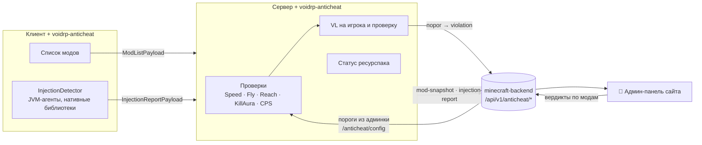
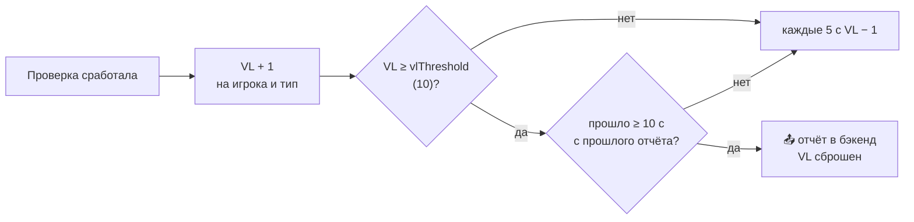

# 🛡️ VoidRP Anticheat

> NeoForge-мод VoidRP: серверные проверки движения и боя с накоплением нарушений (VL), снимок модов клиента,
> поиск инжектов в JVM и пороги, которые админ меняет в панели без рестарта.


[](https://github.com/VOIDRP-MINECRAFT/voidrp-anticheat/actions/workflows/build.yml)


---

## 🗺️ Место в экосистеме



---

## ✨ Возможности

### Проверки

| Проверка | Что ловит | Порог по умолчанию |
|---|---|---|
| **SpeedCheck** | Скорость передвижения выше нормы | `0.75` блока/тик |
| **FlyCheck** | Полёт без разрешения (учитывает зелья, воду, элитры) | `40` тиков в воздухе |
| **ReachCheck** | Удар дальше допустимого | `6.5` блока |
| **KillAuraCheck** | Слишком много целей в секунду и удары по цели за спиной (угол больше ~107°) | `6` целей/с |
| **CpsCheck** | Кликов в секунду выше нормы | `25` CPS |

### Нарушения (Violation Level)



### Целостность клиента
- **ModListPayload** — клиент при входе присылает список модов; бэкенд сверяет его с вердиктами админов.
- **InjectionReportPayload** — клиент сообщает о JVM-агентах и подозрительных нативных библиотеках.
- **Статус ресурспака** — сервер запоминает ответ клиента на серверный ресурспак и прикладывает его к отчётам.

### Пороги из админки
`RemoteConfigManager` получает пороги с бэкенда (`GET /api/v1/anticheat/config`) и применяет их без рестарта;
пока ответа нет, действуют значения из TOML.

---

## 📋 Требования

| Сборка | Minecraft | NeoForge | Java |
|---|---|---|---|
| по умолчанию | 1.21.1 | 21.1.x | 21 |
| `-PmcVer=26.2` | 26.2 | 26.2 | 25 |

Мод ставится **и на сервер, и на клиент**: клиентская часть присылает список модов и отчёт об инжектах.
Версионно-зависимый код — в `src/versions/`.

---

## 🚀 Сборка

```bash
./gradlew build                  # 1.21.1
./gradlew jar -PmcVer=26.2       # 26.2
```

---

## ⚙️ Конфигурация

`config/voidrp_anticheat-server.toml`:

```toml
[general]
enabled = true
backendUrl = "https://api.void-rp.ru"
gameAuthSecret = ""        # X-Game-Auth-Secret этого сервера — только на сервере
serverSlug = ""
vlThreshold = 10

[checks]
speedThreshold = 0.75
flyTicksThreshold = 40
reachThreshold = 6.5
killauraTargetsPerSecond = 6
cpsThreshold = 25
```

---

## 🔗 Связанные репозитории

| Репо | Связь |
|---|---|
| [minecraft-backend](https://github.com/VOIDRP-MINECRAFT/minecraft-backend) | Принимает `/anticheat/violation`, `/anticheat/mod-snapshot`, `/anticheat/injection-report`, отдаёт `/anticheat/config` |
| [voidrp-site](https://github.com/VOIDRP-MINECRAFT/voidrp-site) | Админ-панель: нарушения, вердикты по модам, пороги |

---

<div align="center">
<a href="https://void-rp.ru">🌐 Сайт</a> ·
<a href="https://github.com/VOIDRP-MINECRAFT">🏠 Организация</a>
</div>
